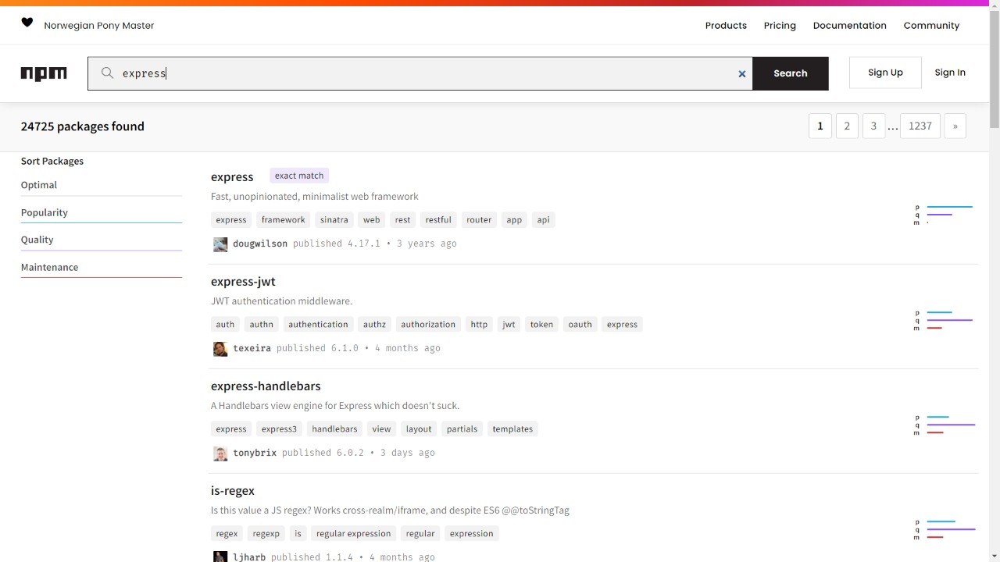

# Packages
The most beautiful part about Node.js is not the JavaScript, it's the thriving community. There are millions of node projects ready to be installed and consumed by your application. These projects are called packages. A package can have several modules and other packages. Node.js has built in support for these packages so you can take advantage of them at any time.

## NPM
### Init
To consume a package, we must first turn our app into a package. We can do this with a simple file called `package.json` on the root of our app. Writing it by hand is cool, but using a CLI called `npm` is better. NPM was already installed when you installed Node.js. In a new folder, run: `npm init`

This will initialze a new package by walking you through a few prompts. Once you're finished, you'll have a `package.json` file that looks like this:
```json
{
  "name": "app",
  "version": "1.0.0",
  "description": "",
  "main": "index.js",
  "scripts": {
    "test": "echo \"Error: no test specified\" && exit 1"
  },
  "author": "",
  "license": "ISC"
}
```
Now are soon to be app is a package. We'll get into how to distribute and deploy different types of Node.js apps, but for now, this package is staying local. Let's take a look at some of these fields:

- `"name"` - is the name of your package. Can be anything since we're local
- `"version"` - is the 🔗[Semantic Version Number](https://semver.org/) or *semver*
- `"main"` - the main entry point into your package
- `"scripts"` - object of custom scripts to be excuted with `npm` cli

## Commands
NPM has several commands at its disposal that you don't need to know really. There are some important ones that you will use repeatedly.

- `npm install` - installs given module(s) from remote registries or local sources
- `npm test` - runs the `test` script in your package.json
- `npm uninstall` - will uninstall a give package
No matter what company you're at or the app, you'll work with these three commands all the time. Unless you're one of the crazies that don't write tests 😘. The rest of the commands will be unique to your app.

## Finding and installing packages
Most modules are hosted on a registry somewhere. The biggest and most used one is, well, the 🔗[NPM registry](https://www.npmjs.com/). They don't stand alone though. Github (which owns NPM now) also allows devs to publish packages to their registry. And there are many others. The sweet thing about NPM, is that you can point to any registry, default being NPM.

A good flow to find a package you need that you don't already know by name yet, is to go the the 🔗[npm site](https://www.npmjs.com/) or Google and search for what you need. Say you need a lib to convert html to PDF's 🤷, NPM will give you back a list of packages.



Once you click a package, you can see the documentation from the `README.md` and any links to Github or website. You can also see the author and the last time it was updated. All of this info is great to help with choosing a package to install. You never know what you're going to get. Once you know the package(s) you want to install, you can do so with:
```bash
npm install package1 package2 package3 --save
```
You can install as many packages with one command as you like. The `--save` flag is to let NPM know to update the package.json's dependency field with all of these packages. We need this because we don't want to check in the downloaded packages into source code for many reason. So how does anyone else on your team, or even you on another machine know what packages this app needs? Well NPM will save the package names and versions so NPM on another machine can look at that and install from there. Your package.json should have updated.

> `--save` is no longer needed from `npm 5.0.0` onwards as installed modules are added as a dependency by default.


You'll also notice a new folder on your project's root named `node_modules`. This is where NPM will install your packages. You should never have to touch this folder. But if you take a peek, you'll see more than the packages you installed. That's because those packages needed other packages, and so on and so on. NPM stores them flat in the node_modules folder. This helps with preventing duplicates and circular dependencies.

# Navigation Link
- [Error Handling](./error_handling.md)
- [CLIs](./cli.md)