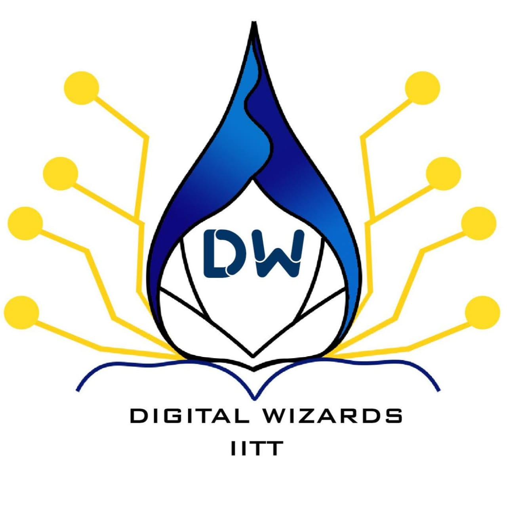

# Welcome

## Intro

Hello 👋 I'm Shubhankar Bhadra and welcome to my Node js session! I'm currently in my 4th year of CSE. I was the coordinator of this club and you can know more about me [here](https://github.com/shobhi1310/)

Do you know how to build sites and apps in the browser with JS? Or maybe you have experience with a language like Python, PHP, or Ruby. Regardless, this session is for anyone who wants to get started with Node fast. Some things we'll be covering in this course include:

- 😱 Node vs Web
- 👀 Modules
- 🔥 File System
- 🎉 CLI's
- 💰 NPM
- 💸 Servers
- ☁️deployment

Shoutout to 🔥**Digital Wizards**🔥 for letting me conduct this session. Follow them on:
- [@digitalwizardiittp](https://www.instagram.com/digitalwizardiittp/)

# Navigation Link
- [What is Node](Lessons/what_is_node.md)